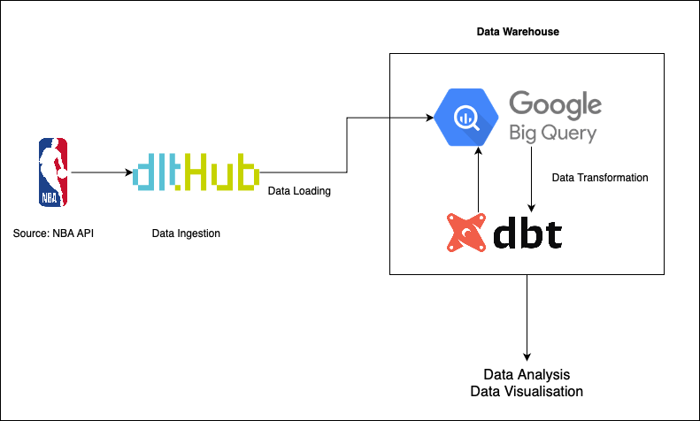

# ELT Data Pipeline (dlt, BigQuery, dbt)
 
I have created a pipeline using dlt (Extract), Google BigQuery (Load) and dbt (Transform) to give an easy overview of using these big data tools to create a smooth data pipeline at scale.

I use the NBA API to ingest data using dlt, and use BigQuery as my data warehouse, and dbt to process queries and transform the stored data.

I am getting deeper into data engineering, and this is my attempt to make it easier for rokies like me to gain hands-on experience of building a pipeline.

Note: I was unable to add the entire dbt-project foler, so I have just added the main model file "team_list.sql" for reference.

## Pipeline
This is an overview of the ELT pipeline

## Installation

I have implemented my project on VSCode in a virtual environment with the Python version 3.13.0

### dlt

1. Install required packages into your environment

        pip install dlt[bigquery]​

2. Initialise a project pipeline by using a pemade dlt project

        dlt init chess bigquery

3. Install dependencies

        pip install -r requirements.txt

### BigQuery

1. Log in to or create a Google Cloud account

    Sign up for or log in to the Google Cloud Platform in your  web browser.

2. Create a new Google Cloud project

    After arriving at the Google Cloud console welcome page, click the project selector in the top left, then click the New Project button, and finally click the Create button after naming the project whatever you would like.

3. Create a service account and grant BigQuery permissions

    You will then need to create a service account. After clicking the Go to Create service account button on the linked docs page, select the project you created and name the service account whatever you would like.

Click the Continue button and grant the following roles, so that dlt can create schemas and load data:

BigQuery Data Editor, BigQuery Job User, BigQuery Read Session User

You don't need to grant users access to this service account now, so click the Done button.

4. Download the service account JSON

    In the service accounts table page that you're redirected to after clicking Done as instructed above, select the three dots under the Actions column for the service account you created and select Manage keys.

This will take you to a page where you can click the Add key button, then the Create new key button, and finally the Create button, keeping the preselected JSON option.

A JSON file that includes your service account private key will then be downloaded.

5. Update your dlt credentials file with your service account info

    Open your dlt credentials file:

        open .dlt/secrets.toml

Replace the project_id, private_key, and client_email with the values from the downloaded JSON file:

    [destination.bigquery]
    location = "US"

    [destination.bigquery.credentials]
    project_id = "project_id" # please set me up!
    private_key = "private_key" # please set me up!
    client_email = "client_email" # please set me up!

You can specify the location of the data, i.e., EU instead of US, which is the default.

### dbt

1. Install required packages

        pip install dbt-core dbt-bigquery

2. Initialise a dbt project from your terminal

        dbt init your_project_name
## Steps

### 1. Data Ingestion and Loading

- Fetch NBA teams data from the NBA API.
- Fetch all time game data for each team using LeagueGameFinder and team_id.
- Append all the teams' game data into a combined dataframe.
- Drop duplicate games to maintain clean and usable data.
- Load individual tables and the combined table onto BigQuery.

### 2. Data Transformation
- Create your_dbt_model.sql under the models folder in your_dbt_project
- Write SQL code to take distinct values of team_id, team_name, and team_id to create a view of all the NBA teams
- In terminal, go to your dbt project directory.

        cd your_dbt_project

- Run the code

        dbt run
